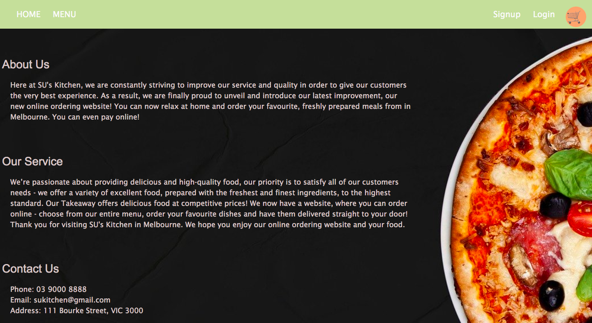
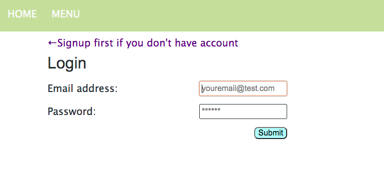
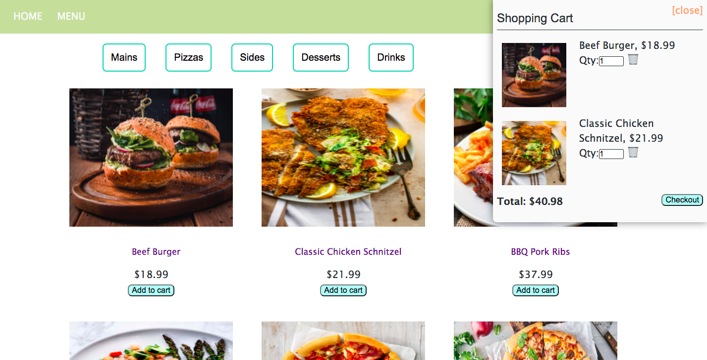

## Food Online Order

## Overview

 The app was built with MERN stack, a React front end, MongoDB database, and Node.js/Express.js server and API. Also has Stripe payment integrated allowing fully functional test payments.

## Technologies used
* React
* graphQL
* Mongoose
* Express
* Node 
* Stripe
* GitHub 


## Deployment
* GitHub repository: https://github.com/SusanSu123/MERN---food-order-app.git
* Heroku: https://food-online-order.herokuapp.com/


## User Story

```md
AS A customer
WHEN I want to order some food online
THEN I can find menu from site of a local restaurant
WHEN I signup or login 
THEN I can add selected food into Cart
WHEN I checkout
THEN I can make a payment and complete the order


```


## Mock-Up



